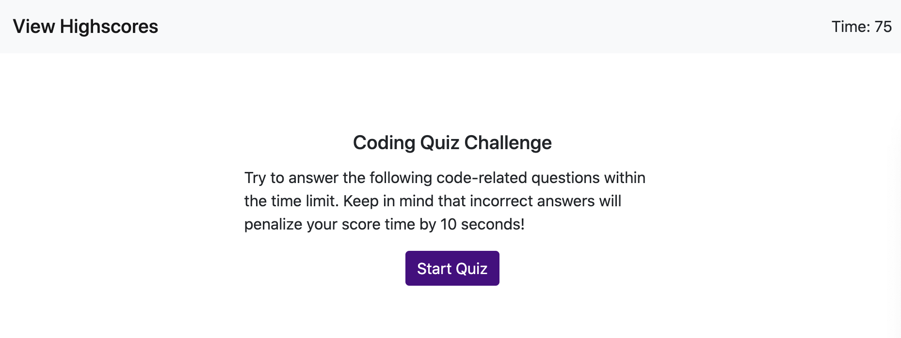
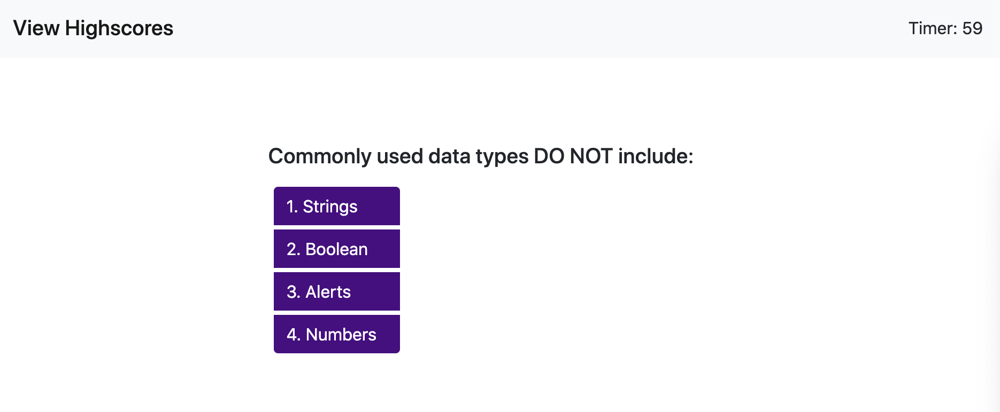
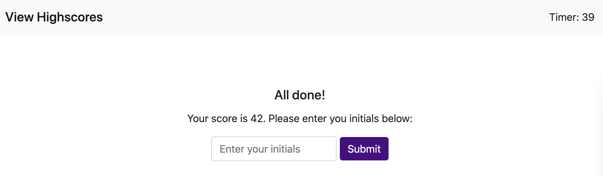
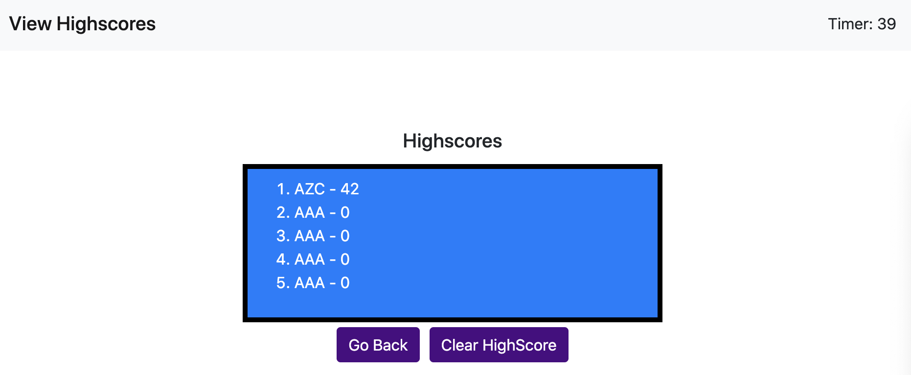

# HW4 Web APIs: Code Quiz

## The Application

I created an application of a timed quiz on JavaScript fundamentals that stores high scores
so that one can use my application to gauge their progress with their peers.  

## Features

This application will have 4 main screens.  The user will use the buttons to navigate between the starting screen, choosing the questions, and enter in the high scores.  

### Starting Screen for Quiz

### Questions Screen for Quiz

When a user clickes on a right answer, "Right Answer!" message will appear on the bottom.  Otherwise, "Wrong Answer!" will appear. 

### Enter Highscore Screen for Quiz 

The user can enter his or her initial.  If their scores are top 5, their name will appear on the highscores scoreboard.

### Highscore Scoreboard Screen

## Learnings 

1. Code can be better organized.  Can refractor and use JQuery to simplify the code.  Need to think about the organization first in the next homework. 

## Link to finished product website
[Link to finished product](https://alzcheng.github.io/HW4/)
